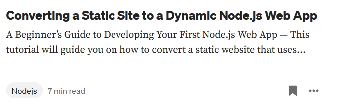

## Purpose

I write technical tutorials about web developer, developer tools, and open-source software to help fellow developers learn complex topics and discover new tools that can help them with their work.

My technical tutorial, How to Develop and Deploy Your First Full-Stack Web App received over 40,000 views on FreeCodeCamp

## Featured Article

