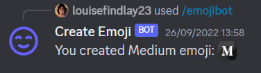

## Purpose

Creating custom emoji for your Discord server is fun but only users with permission can create emoji. 

Create Emoji Bot democratises creating Discord emoji by letting anyone create custom emoji by calling Create Discord Emoji bot.

## Screenshot

