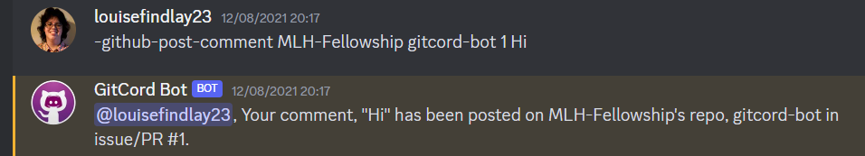

## Problem

During the Major League Hacking Pre-Fellowship, I noticed a documentation problem. It was great to use Discord for quick communication but it was time consuming to have to cross-post the information to GitHub so we could store project information for the future.

## Solution

We created GitCord Bot to cross-post our Discord messages to GitHub using Discord.js and Octokit.js. 

I developed the GitHub API integration and bot commands to post comments on GitHub issues and PRs, post and edit standup notes in GitHub organizations, and create and manage GitHub projects.

## Screenshot

