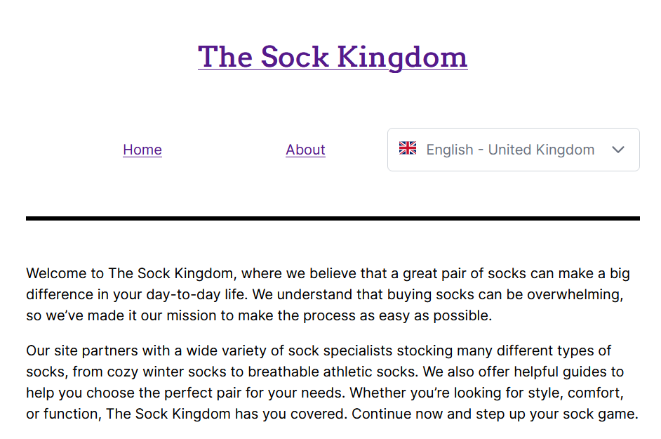

## Purpose

The Sock Kingdom is a blog developed to bring support for Prismic locales to Nuxt 3.

I used Nuxt 3's i18n module to enable internationalization, PrimeVue's Dropdown component to create the language switcher select element, and flag-icons to display the language icons.

## Website

