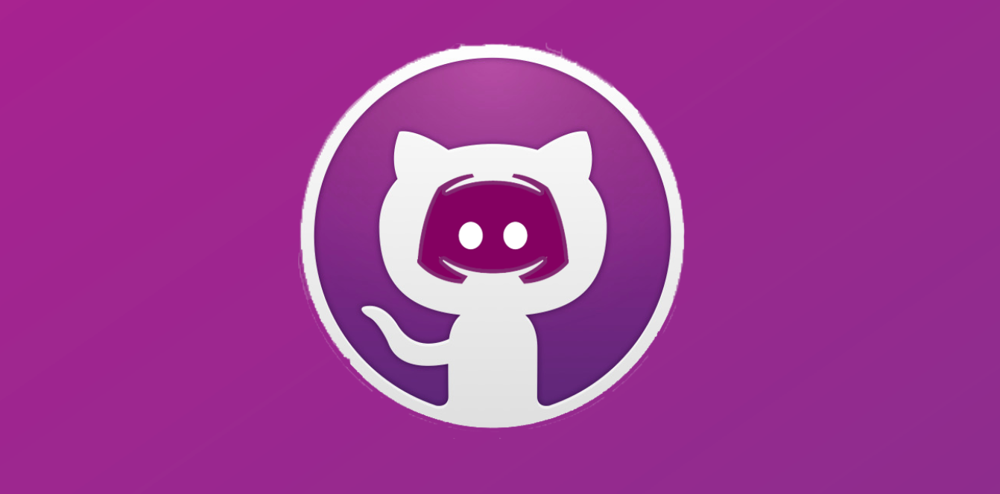

## Achievements

Participated in Batch 3 of the MLH Pre-Fellowship with Pod 3.1.3 (14 developers across the globe including our pod leader), working asynchronously on two hackathons.

Won a Special Contributions award for my work on the Hugo portfolio site, creating a testimonials section, PR templating, implementing performance improvements, and assisting my pod with doubt and code review sessions.

Developed a Discord bot to save developers' time and improve communication between messaging platforms and GitHub. Integrated the GitHub API with our team's bot to allow developers to communicate on Discord and create, edit and comment on GitHub issues, PRs, and standup notes. Deployed to Linode and managed with PM2.

## Project

