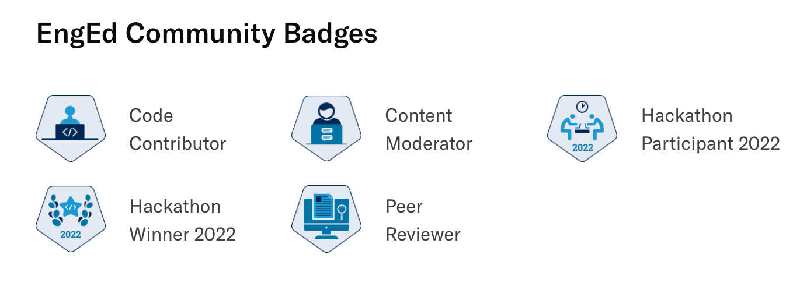

## Achievements

Wrote, reviewed, and published articles for Section’s Engineering Education programme.

My first article, How to Develop and Deploy Your First Full-Stack Web App received over 40,000 views on FreeCodeCamp.

Chosen as the first Peer Reviewer to review articles for style, grammar, and technical accuracy. Developed review guidelines for the programme.

Became one of the first Content Moderators to oversee the entire publication process and onboard new writers. Added new features to the website such as related articles and author RSS feeds. 

Won the Kubernetes Hackathon.

